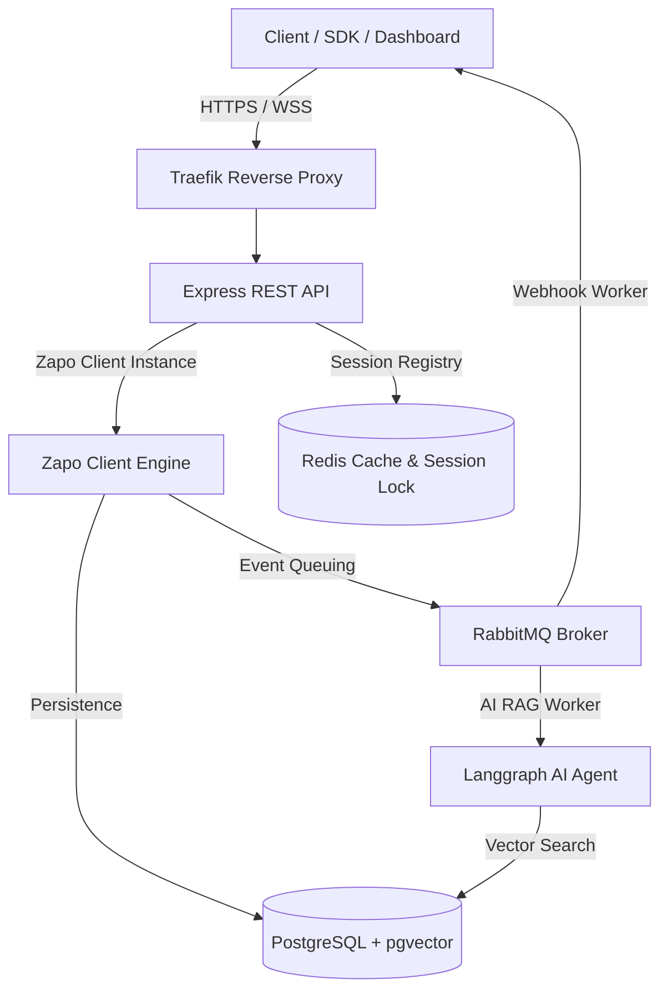

# Zap-Zap Project Plan

Este documento descreve o plano de implementação para a API REST não-oficial do WhatsApp baseada na biblioteca `zapo` (`zapo-js`), focando em alta escalabilidade, resiliência, e qualidade de código com as melhores práticas de desenvolvimento, utilizando npm workspaces.

---

## 1. Visão Geral da Arquitetura

A arquitetura do projeto segue o modelo de monorepo, separando a API REST (Express), o Painel de Controle (Vue 3), os Workers de mensageria (RabbitMQ Consumers) e a inteligência artificial (Langgraph + pgvector).



---

## 2. Tecnologias & Stack Escolhidas

### Backend & Ferramental

- **TypeScript**: Tipagem estática em todo o projeto.
- **Node.js + Express**: Servidor REST rápido para controle das instâncias.
- **Zapo (`zapo-js`)**: Biblioteca para Noise Protocol e Signal E2EE.
- **Prisma (Latest)**: ORM moderno para o schema da aplicação (Controle de sessões, usuários, logs de webhook e RAG).
- **PostgreSQL (`@zapo-js/store-postgres`)**: Armazenamento nativo do Zapo para Double-Ratchet, Signal pre-keys e sessão criptográfica, rodando em paralelo com a aplicação Prisma.
- **pgvector**: Armazenamento de embeddings para RAG no Postgres.
- **Redis**: Controle de concorrência distributed locks (essencial para evitar conexões simultâneas da mesma sessão) e rate-limiting.
- **RabbitMQ**: Gerenciamento de filas para envio de webhooks e disparos em massa.

### Qualidade de Código & Lints

- **Prettier**: Formatação padronizada de código.
- **ESLint**: Lints robustos com regras de TypeScript estritas.
- **TypeScript Typecheck**: Script global (`tsc --noEmit`) para validação estática contínua em CI/CD.

### Logs & Observabilidade

- **Pino**: Logger ultra rápido estruturado em JSON para produção, com `pino-pretty` habilitado para ambiente de desenvolvimento.

---

## 3. Estruturação do Monorepo (Workspaces npm)

O projeto usará workspaces nativos do npm para gerenciar pacotes compartilhados e aplicações:

```text
/home/lildiop2/Documentos/whatsapp-unofficial-api/
├── package.json                   # Dependências raiz e configuração dos npm workspaces
├── tsconfig.json                  # Configuração base do TypeScript
├── .prettierrc                    # Configuração de formatação Prettier
├── .gitignore                     # Arquivos ignorados pelo Git
├── Dockerfile.api.prod            # Imagem Docker otimizada para a API
├── Dockerfile.worker.prod         # Imagem Docker otimizada para o Worker
├── apps/
│   ├── api/                       # API Express REST
│   │   ├── package.json
│   │   ├── tsconfig.json
│   │   ├── prisma/
│   │   │   └── schema.prisma      # Schema da aplicação com Prisma
│   │   └── src/
│   │       ├── index.ts
│   │       ├── services/          # Conexões DB, Redis, RabbitMQ
│   │       ├── zapo/              # Gerenciador de WaClient do Zapo
│   │       └── routes/
│   ├── worker/                    # Consumidores RabbitMQ
│   └── dashboard/                 # Frontend Vue 3 + Vite
└── packages/
    └── shared/                    # Tipos e utilitários compartilhados
```

---

## 4. Schema do Banco de Dados (Prisma)

O Prisma gerenciará as tabelas da aplicação, enquanto o Zapo terá suas tabelas de mensagens e criptografia gerenciadas automaticamente pelo `@zapo-js/store-postgres` (usando o prefixo de tabela `wa_`).

```prisma
// apps/api/prisma/schema.prisma

datasource db {
  provider = "postgresql"
  url      = env("DATABASE_URL")
}

generator client {
  provider = "prisma-client-js"
}

enum SessionStatus {
  DISCONNECTED
  PAIRING_REQUIRED
  CONNECTING
  CONNECTED
}

model User {
  id        String   @id @default(uuid())
  email     String   @unique
  password  String
  createdAt DateTime @default(now())
  updatedAt DateTime @updatedAt
}

model WhatsappSession {
  id            String        @id @default(uuid()) // sessionId correspondente no Zapo
  name          String
  status        SessionStatus @default(DISCONNECTED)
  webhookUrl    String?
  createdAt     DateTime      @default(now())
  updatedAt     DateTime      @updatedAt
  webhookLogs   WebhookLog[]
  messages      SentMessage[]
}

model WebhookLog {
  id         String          @id @default(uuid())
  sessionId  String
  session    WhatsappSession @relation(fields: [sessionId], references: [id], onDelete: Cascade)
  event      String          // ex: "message", "connection"
  payload    Json
  statusCode Int?
  success    Boolean
  createdAt  DateTime        @default(now())
}

model SentMessage {
  id         String          @id @default(uuid())
  sessionId  String
  session    WhatsappSession @relation(fields: [sessionId], references: [id], onDelete: Cascade)
  recipient  String
  content    String
  messageId  String          // ID gerado pelo Zapo/WhatsApp
  status     String          // ex: "pending", "sent", "delivered", "read", "failed"
  createdAt  DateTime        @default(now())
}
```

---

## 5. Resiliência: Reconexão e Retry

### Conexão Zapo com Backoff Exponencial

Zapo não se reconecta automaticamente. Criaremos um gerenciador de conexões que escuta o evento `connection` e, caso ocorra fechamento não voluntário (`isLogout: false`), executa tentativas de reconexão aplicando backoff exponencial com jitter.

```typescript
// Exemplo conceitual do algoritmo de reconexão
import pRetry from 'p-retry';

async function connectSession(client: WaClient) {
  const runConnect = async () => {
    logger.info(`Tentando conectar sessão ${client.sessionId}...`);
    await client.connect();
  };

  try {
    await pRetry(runConnect, {
      retries: 5,
      factor: 2,
      minTimeout: 2000, // 2s
      maxTimeout: 30020, // 30s
      onFailedAttempt: error => {
        logger.warn(
          `Tentativa de reconexão falhou para ${client.sessionId}. Erro: ${error.message}`,
        );
      },
    });
  } catch (error) {
    logger.error(`Todas as tentativas de reconexão falharam para ${client.sessionId}`);
  }
}
```

### RabbitMQ Dead Letter Exchange (DLX)

Para falhas no envio de webhooks aos servidores dos clientes (ex: servidor do cliente fora do ar), o RabbitMQ enviará as mensagens para uma fila de DLX (Dead Letter Exchange) para retry posterior com delay progressivo, garantindo que nenhum evento seja perdido.

---

## 6. Dockerfile de Produção Otimizado (Multi-Stage)

Utilizaremos o modelo multi-stage do Docker com npm para gerar uma imagem extremamente enxuta contendo apenas dependências de produção compiladas e o Prisma Client gerado.

```dockerfile
# Dockerfile.api.prod

# Stage 1: Build
FROM node:20-slim AS builder
WORKDIR /app

RUN apt-get update && apt-get install -y openssl && rm -rf /var/lib/apt/lists/*

# Copiar arquivos de workspace
COPY package.json package-lock.json tsconfig.json ./
COPY packages/shared/package.json ./packages/shared/
COPY apps/api/package.json ./apps/api/

# Instalar todas as dependências usando npm workspaces
RUN npm ci

# Copiar código-fonte
COPY packages/shared ./packages/shared
COPY apps/api ./apps/api

# Gerar Prisma Client
WORKDIR /app/apps/api
RUN npx prisma generate

# Build TypeScript
WORKDIR /app
RUN npm run build --workspace=apps/api

# Prunar dependências de desenvolvimento
RUN npm prune --omit=dev --workspace=apps/api

# Stage 2: Runner
FROM node:20-slim AS runner
WORKDIR /app
ENV NODE_ENV=production

RUN apt-get update && apt-get install -y openssl && rm -rf /var/lib/apt/lists/*

# Copiar dependências de produção do builder
COPY --from=builder /app/node_modules ./node_modules
COPY --from=builder /app/packages/shared/dist ./packages/shared/dist
COPY --from=builder /app/apps/api/dist ./apps/api/dist
COPY --from=builder /app/apps/api/node_modules ./apps/api/node_modules
COPY --from=builder /app/apps/api/prisma ./apps/api/prisma
COPY --from=builder /app/apps/api/package.json ./apps/api/package.json

EXPOSE 3002

CMD ["node", "apps/api/dist/index.js"]
```

---

## 7. Cronograma de Desenvolvimento (Branches)

1. **`feature/monorepo-setup`**: Setup base (TypeScript, Prettier, Workspaces npm).
2. **`feature/database-setup`**: Docker Compose com Postgres/pgvector, Redis, RabbitMQ e Schema Prisma inicial.
3. **`feature/session-manager`**: Motor do Zapo com resiliência de reconexão e logs Pino.
4. **`feature/rest-api`**: Rotas Express para sessões e mensagens.
5. **`feature/rabbitmq-webhooks`**: Workers para entrega de webhooks com DLX.
6. **`feature/docker-prod`**: Dockerfiles otimizados e teste de build local.
