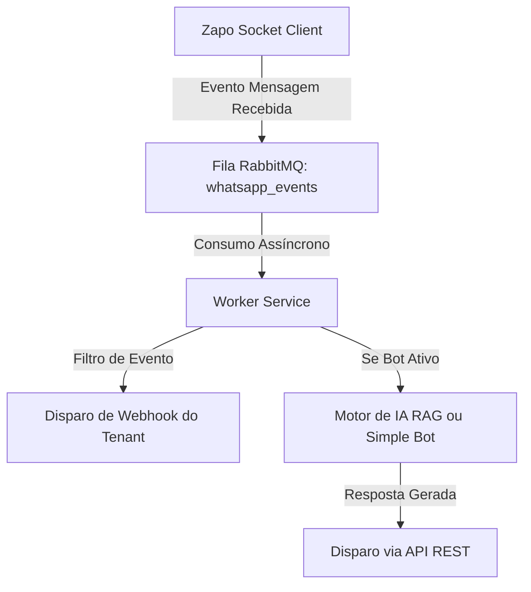

# Arquitetura do Projeto - Zap-Zap

Este documento descreve a arquitetura geral do sistema **Zap-Zap Unofficial API**, um monorepo escalável voltado para o gerenciamento de múltiplas instâncias do WhatsApp, automatização de atendimento com Inteligência Artificial (RAG) e envio massivo de mensagens.

---

## 📂 Estrutura do Monorepo

O projeto é estruturado utilizando **NPM Workspaces** para gerenciar as dependências do monorepo de forma centralizada e modular:

```text
├── apps/
│   ├── api/          # API REST principal em Express e TypeScript
│   ├── worker/       # Worker RabbitMQ para processamento de webhooks e IA
│   └── dashboard/    # Frontend administrativo em Vue 3 (Vite + TypeScript)
├── packages/
│   └── shared/       # Código e schemas compartilhados (Zod, tipos, utilitários)
├── docs/             # Documentação oficial do projeto
├── PLAN.md           # Planejamento estratégico e passos de desenvolvimento
└── tsconfig.json     # Configuração global do TypeScript
```

---

## ⚙️ Componentes da Infraestrutura

O Zap-Zap é integrado aos seguintes serviços e banco de dados externos (configurados via `.env`):

1. **PostgreSQL**: Banco de dados relacional principal. Armazena dados de Tenants, usuários, chaves de API, logs de auditoria e sessões de WhatsApp.
   * **Aviso de Migração (Zapo Table Drift)**: As sessões do WhatsApp geram tabelas dinâmicas internas com prefixo `wa_`. Por isso, novas alterações de banco de dados no Prisma devem ser aplicadas incrementalmente por scripts SQL manuais, evitando comandos agressivos como `prisma db push` que possam deletar dados temporários das conexões do WhatsApp.
2. **RabbitMQ**: Message broker responsável pelo desacoplamento e processamento assíncrono de:
   * Eventos de webhooks externos a serem enviados.
   * Mensagens recebidas que precisam passar pelo fluxo de Inteligência Artificial.
3. **Redis**: Cache em memória de alta performance. Armazena o estado das credenciais de autenticação do Zapo e tokens de pareamento temporários.

---

## 🔄 Fluxo de Mensagens e Mensageria (RabbitMQ)

O processamento de eventos do WhatsApp (como recebimento de mensagens e atualizações de conexão) segue um fluxo assíncrono para garantir a resiliência da API:



---

## 📝 Política de Logs e Rotação em Desenvolvimento

Para facilitar a depuração e monitoramento em ambiente de desenvolvimento, implementamos uma estrutura de logs limpa e rotativa:

1. **Limpeza de Metadados**: Removemos campos redundantes como `pid`, `hostname` e `time` em todas as instâncias do `Pino Logger` no monorepo (usando `base: null` e `timestamp: false`). Isso reduz o tamanho ocupado no disco e melhora a legibilidade das saídas no console.
2. **Rotação de Arquivos (`pino-roll`)**: Em desenvolvimento, os logs são salvos em arquivos físicos locais dentro do diretório `./logs` de cada workspace. Os arquivos são rotacionados diariamente ou quando atingem `10MB`, sendo automaticamente ignorados pelo controle de versão do Git.
